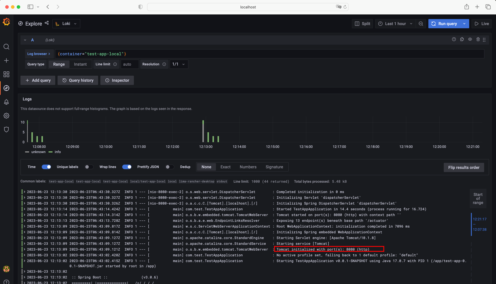

# test-app

### CURL REQUEST
~~~
curl --location 'http://localhost:8085/api/hello'
~~~

### GET ALL NAMESPACE:
~~~
kubectl get ns
~~~

### CREATE A NAMESPACE:
~~~
kubectl create namespace local
~~~

### SET CONTEXT TO NAMESPACE
~~~
kubectl config set-context --current --namespace=local
~~~

### SET THE CURRENT CLUSTER AND NAMESPACE
~~~
kubectl config set-context rancher-desktop --namespace=local
kubectl config use-context rancher-desktop --namespace=local
~~~

### GET ALL RESOURCES FROM NAMESPACE
~~~
kubectl get all -n local 
kubectl get pods -o wide
~~~

### DESCRIBE K8S RESOURCES
~~~
kubectl describe pod test-app-6d6b9cfd8b-dgmvc 
kubectl describe ingress test-app
kubectl describe deployment test-app
kubectl describe service test-app
~~~

### DOCKER BUILD
~~~
docker build -f Dockerfile -t test-app .
docker tag test-app dhananjayasinghar/test-app
docker push dhananjayasinghar/test-app
~~~

### CREATE K8S DEPLOYMENT
~~~
kubectl create -f k8s/deployment.yaml -n local
OR IF ALREADY CREATED
kubectl apply -f k8s/deployment.yaml -n local
~~~

### CREATE K8S SERVICE
~~~
kubectl create -f k8s/service.yaml -n local
OR IF ALREADY CREATED
kubectl apply -f k8s/service.yaml -n local
~~~

### CREATE K8S INGRESS [NOT WORKING WITH LOCAL KUBERNETES]
~~~
kubectl create -f k8s/ingress.yaml -n local
OR IF ALREADY CREATED
kubectl apply -f k8s/ingress.yaml -n local
~~~

### CREATE K8S CONFIGMAP
~~~
kubectl create -f k8s/configmap.yaml -n local
OR IF ALREADY CREATED
kubectl apply -f k8s/deployment.yaml -n local

kubectl get configmap
kubectl describe configmap nginx-cfgmap
~~~

### CREATE K8S CONFIGMAP FROM A LOCAL FILE 
~~~
kubectl create configmap index-file-config-map --from-file=/Users/dhananjaya.singhar/Documents/GitHub/test-app/src/main/resources/index.html
~~~

### UPDATE K8S CONFIGMAP FROM A LOCAL FILE WITHOUT DELETING EXISTING
~~~
kubectl create configmap index-file-config --from-file=/Users/dhananjaya.singhar/Documents/GitHub/test-app/src/main/resources/index.html -o yaml --dry-run=client | kubectl apply -f -
~~~

### PORT FORWARD TO A POD
~~~
kubectl port-forward pod/test-app-6d6b9cfd8b-dgmvc 8085:8080
~~~

### PORT FORWARD TO A SEVICE
~~~
kubectl port-forward service/test-app 8085:8080
~~~

### CREATE A LB SERVICE 
~~~
kubectl expose deployment test-app --type=LoadBalancer --name=test-app-lb --port=8080
~~~

### SCALE UP/DOWN THE POD
~~~
kubectl scale --replicas=3 deployment test-app -n local
~~~

### ACCESS POD
~~~
kubectl exec -it test-app-5d6cb578d-gxn4f sh
~~~

### CLEANUP
~~~
kubectl delete deployment test-app
kubectl delete service test-app
kubectl delete ingress test-app
kubectl delete ns local
~~~

### CREATE CUSTOM SECRET FROM FILE
~~~
kubectl create secret generic my-secret --from-file=/Users/dhananjaya.singhar/Documents/GitHub/test-app/src/main/resources/index.html
kubectl describe secret my-secret 

kubectl create secret generic my-secret-html --from-file=/Users/dhananjaya.singhar/Documents/GitHub/test-app/src/main/resources/index.html -o yaml

kubectl create secret generic my-secret-html --from-file=/main/resources/a.txt --from-file=/main/resources/b.txt -o yaml

~~~

### RESTART DEPLOYMENT
~~~
kubectl rollout restart deployment test-app-local
~~~

### HELM DEPLOYMENT
~~~
cd /Users/dhananjaya.singhar/Documents/GitHub/test-app

helm lint ./helm/charts
helm template ./helm/charts
helm install test-app-svc ./helm/charts
helm uninstall test-app-svc
~~~

### HELM ENV SPECIFIC DEPLOYMENT & APPLY UPDATED VALUES
~~~
helm install -f ./helm/charts/values/local-values.yaml test-app-svc ./helm/charts -n local
helm upgrade --install -f ./helm/charts/values/local-values.yaml test-app-svc ./helm/charts -n local
~~~

### CHECK LOGS IN GRAFANA USING PROMPTAIL AND LOKI
~~~
helm repo list
helm repo update
helm search repo grafana
helm repo add grafana https://grafana.github.io/helm-charts
helm show values grafana/loki-stack > /tmp/loki-stack-values.yaml 
# Edit like loki-stack-values.yaml

# Check k8s Storage
kubectl get sc

helm install loki-stack grafana/loki-stack --values /Users/dhananjaya.singhar/Documents/GitHub/test-app/helm/charts/values/loki-stack-values.yaml -n loki --create-namespace

helm list -n loki
helm list -A

kubectl -n loki get all

// Check persistent volume 
kubectl -n loki get pv,pv

kubectl -n loki port-forward service/loki-stack-grafana 3000:80
Open Grafana in :  http://localhost:3000/

kubectl get secrets -n loki
kubectl -n loki get secret loki-stack-grafana -o yaml
Get the admin-password and decode using below command
echo "VTd4Q2ZzSWlDaFNRa0hmTjF1TXVyb1Q3dnc0amlGS1FITzkzMk0yUQ==" | base64 -d; echo
OR
kubectl get secrets -n logging loki-stack-grafana --template='{{index .data "admin-password" | base64decode}}'

Select your container and namespace in log explorer and check the logs :)
~~~

================================================================

